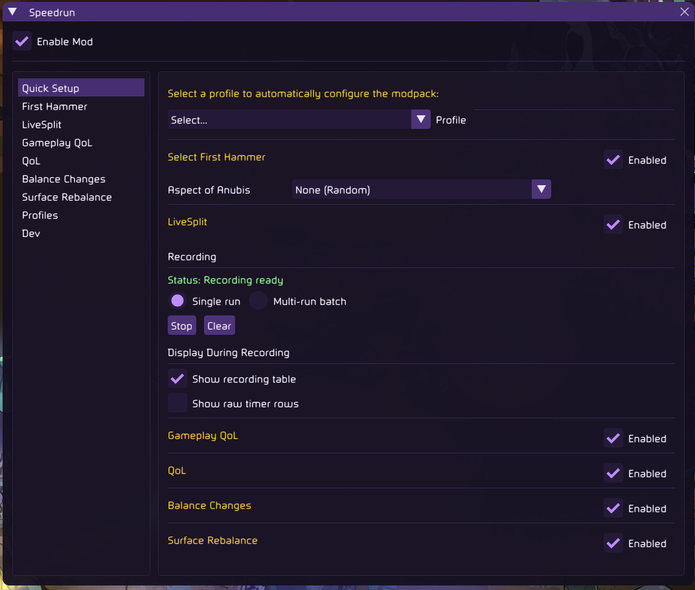
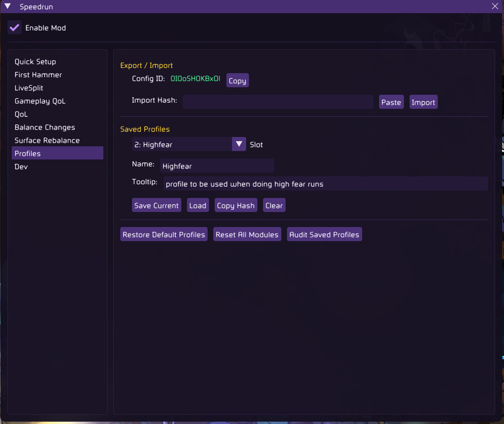
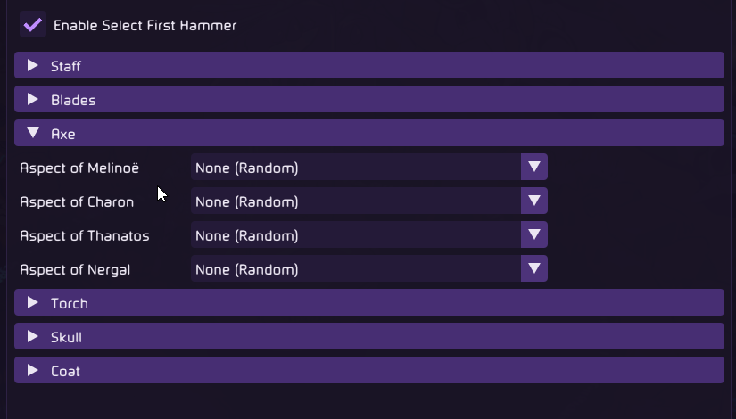
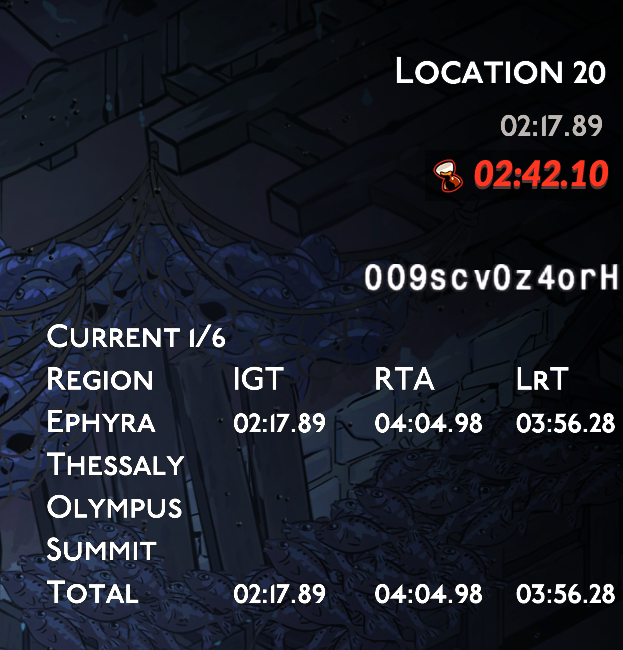
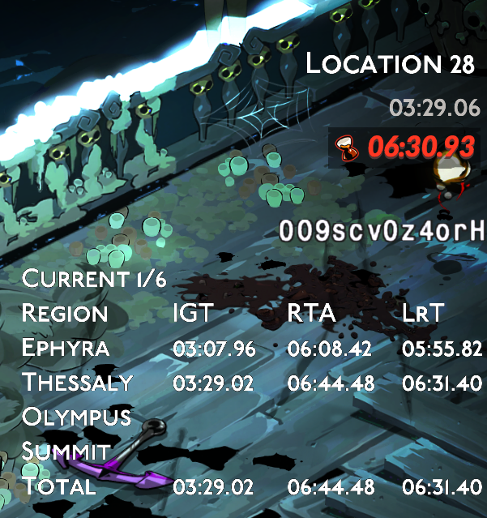
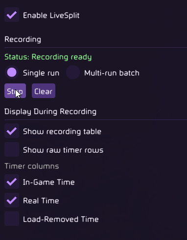
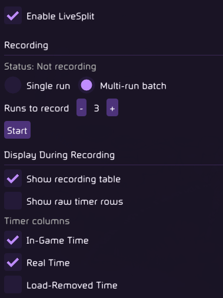

# Speedrun Modpack

Unrelated Mod to the Hades 1 modpack. Just slightly inspired by it is all.

This is a modular Hades II modpack. Every module here can either be installed individually or part of the pack. It brings together first-hammer selection, in-game LiveSplit-style timing, quality-of-life options, gameplay-flow quality-of-life adjustments, minor balance/description fixes, and Surface route adjustments under one shared Speedrun settings window.

## What the pack brings instead of individual installs

### Unified UI
Have a single unified UI panel to manage all module toggles, settings, and shared options.

The Quick Setup tab gives each included module a compact enable toggle so a profile can be configured without jumping between separate mod menus.

### Profiles
Save different configurations, such as Any Fear, High Fear, RTA, or multi-run practice, into profiles and load them with one click in game.

Profiles store the shared Speedrun settings state, making it easier to swap between routing, practice, and submission setups.

### Hashing
While the pack is installed, a unique fingerprint will be shown on the side to identify the settings that pack has been configured with.

## Included Modules

### Select First Hammer

Choose the guaranteed first Daedalus Hammer for each weapon aspect.

Instead of taking a random first hammer, you can assign a specific opener to every aspect in the game. Leaving an aspect on None (Random) preserves vanilla behavior for that aspect.

Coverage is grouped by weapon and aspect:

- Staff
- Blades
- Axe
- Torch
- Skull
- Coat

#### Hammer Panel Options

### LiveSplit

Adds native LiveSplit-like timing support to the game.

#### Examples
The recording table can show biome splits with selected timing columns while a run is active.

LiveSplit records runs and shows selected timing information while you play. Its main feature is a compact recording table that tracks your route through a run.

Supported timing views include:

- Underworld routes: Erebus, Oceanus, Fields, and Tartarus
- Surface routes: Ephyra, Thessaly, Olympus, and The Summit
- Dream Dive routes, with biome order detected from the run
- Single-run split recording
- Multi-run batch recording for routing or practice sessions
- IGT, RTA, and LrT timing columns

#### Options while doing single run repeated recording
Single-run mode keeps the next run ready for split recording and is aimed at repeated normal attempts.

#### Options while doing multi run repeated recording
Multi-run mode records a batch of consecutive runs and keeps cumulative batch totals.

### Quality of Life

Adds practical speedrun quality-of-life options for cleaner menus, faster resets, and better keyboard-and-mouse handling.

Current options:

- KBM Escape Fix
  Makes Escape work during boon and pom selection, Hex selection, Path of Stars, and death sequences.
- Rerolling Saves the Game
  Saluting the Oath statue now triggers a game save.
- Always Show Location
  Always displays the current location in the UI.
- Skip Death Cutscene
  Skips the death cutscene and returns you to the main menu faster while still showing the death screen.
- Auto Skip Dialogue
  Automatically skips dialogue prompts during gameplay.
- Skip Run End Cutscene
  Skips the end-of-run cutscene and returns you to the main menu faster while still showing the victory screen.
- Spawn in Training Grounds
  Spawns you in the Training Grounds instead of the House of Hades. Useful for testing and practicing.
- Arcana & Fear on Victory Screen
  Displays Arcana and Fear on the victory screen.

### Gameplay QoL

Adds run-flow and routing helpers without changing the broader balance package.

Current options:

- Familiar Delay Fix
  Fixes Familiars being summoned after a delay upon entering a room.
- Miniboss Encounter Fix
  Fixes minibosses with top-screen health bars not properly progressing biome depth.
- Skip Gem Boss Reward
  Stops bosses from dropping gem rewards when using Grave Thirst.
- Prevent Echo Scam
  Blocks both Fields minibosses from spawning in room 3 to prevent Echo scam.
- Disable Selene Before First Boon
  Prevents Selene from spawning before the first boon is obtained.
- Disable Arachne Pity
  Disables Arachne pity entirely for Any Fear runs.
- Force Arachne Spawn
  Forces Arachne to spawn to reduce death pity reset.
- Force Medea Spawn
  Forces Medea to spawn to reduce death pity reset.
- Incrementing Fig Leaf
  Dionysus skip chance starts at the default value, increases by 13% after every encounter, and resets on biome start.

### Balance Changes

Adds optional fixes and rule changes that alter weapon, boon, encounter, or damage behavior for speedrun consistency.

Current options:

- Anubis Wall Placement Fix
  Fixes Mirrored Ankh omega attack wall placement based on casting angle.
- Omega Cast Fix
  Fixes omega-cast moves not counting as cast damage.
- Poseidon Waves Fix
  Fixes Poseidon waves on Axe special and Hidden Helix Torch.
- Remove Second Channeling
  Removes the second charge stage of Glorious Disaster and Giga Moonburst, baking the bonus into stage 1.
- Shimmering Moonshot Fix
  Fixes Shimmering Moonshot not applying its damage bonus to omega special.
- Aspect of Selene Fix
  Treats Aspect of Selene's built-in Hex as the run's Selene pickup so Path of Stars replaces normal Selene drops. Skyfall starts at full Moonglow.
- Axe Omega Channel Fix
  Fixes Axe omega attack not benefiting correctly from channeling bonuses.
- Tidal Ring Fix
  Fixes Tidal Ring not hitting the same mob twice with Circe.
- Suffering Fix
  Fixes Suffering on Sight not bypassing the Wards vow when dealing damage.

### Surface Rebalance

Adds Surface-specific route and encounter changes for speedrun routing.

Current options:

- Force Thessaly Miniboss
  Forces one Thessaly miniboss to appear between rooms 2-4.
- Force Olympus Midshop
  Forces the Olympus midshop to appear between rooms 5-7.
- Remove Thessaly Heracles
  Removes Heracles encounter options from Thessaly.
- Adjust Charybdis Behavior
  At phase transition, tentacles despawn in 1 second instead of 9 seconds. Charybdis fires 6 spits instead of 8.

## How To Use

Install via r2modman. In game, open the Speedrun menu and configure the modules from the shared settings window.

The Quick Setup tab provides module-level enable toggles. Open a module tab for individual settings.

## More Information

- [Changelog](CHANGELOG.md)
- [Speedrun shell repo](https://github.com/h2pack-speedrun/speedrun-modpack)
